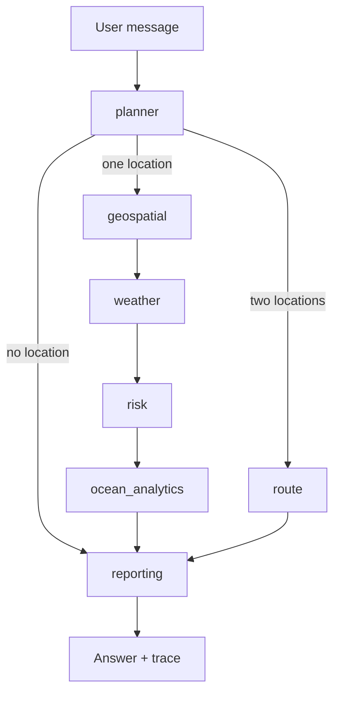

# ORCA — Agentic Marine Intelligence Platform

ORCA is a conversational assistant for fishermen, coastal stakeholders, and marine
researchers. Ask it things like *"is it safe to go out near Kochi tomorrow morning?"*,
*"where's the nearest good fishing zone?"*, or *"what's the safest route from Kochi to
Alappuzha?"* — a pipeline of specialist AI agents plans, fetches real live/cached marine
data, correlates it, and answers with a visible reasoning trace, a map, and cited sources.

Built for Smart India Hackathon problem statement **SIH26176**.

## What it can answer

- **Safety check** — "is it safe to go out near `<place>` `<when>`?" (waves, wind, cyclone, lightning)
- **Fishing zones** — "where's the nearest good fishing zone near `<place>`?" (SST + chlorophyll correlation, with a 7-day trend)
- **Alerts** — "any cyclone or lightning alerts near `<place>`?" (live global feeds)
- **Route safety** — "what's the safest route from `<place A>` to `<place B>`?" (waypoint hazard scan, not full navigation — see [Known limitations](#known-limitations))
- **Multi-turn follow-ups** — "what about Thursday instead?" reuses context from earlier in the conversation
- **Proactive alerts** — while a chat tab stays open, ORCA re-checks conditions every 5 minutes and pushes a warning if things turn unsafe, without being asked

Every answer comes with a **reasoning trace panel** showing exactly which agents ran, what
data they used, whether it was live or cached, and why the answer says what it says — this
is the core "agentic reasoning made visible" requirement, not decoration.

## Architecture

```
Next.js frontend  ◄──SSE──  FastAPI backend
  chat panel                  POST /chat        → LangGraph pipeline:
  reasoning trace             GET  /sessions/*    planner → geospatial → weather → risk
  Leaflet map                 GET  /alerts/stream           → ocean_analytics → reporting
```

**Backend** (`backend/`, Python/FastAPI/LangGraph): a fixed graph of thin specialist
agents. Every external data source is a *connector* with the same contract —
`{data, source, fetched_at, is_cached}` — that retries a live fetch once, then falls back
to a committed snapshot. **A connector never fabricates data.**

**Frontend** (`frontend/`, Next.js/TypeScript): streams the backend's Server-Sent Events,
renders the chat, the reasoning trace, and a Leaflet map (with route visualization when
applicable).

See [`CLAUDE.md`](./CLAUDE.md) for the full architecture writeup, every deliberate
deviation from the original spec, and why each one was made — it's written for an AI
assistant working in this repo, but it's the most complete and current technical
reference either way.

## Workflow



## Wireframe

```
+----------------------------------------------------------------+
| Hazard alert banner (shown only when active)         [Dismiss] |
+------------------+------------------+----------------------------+
| Chat panel       | Reasoning trace  | Map                        |
|                  |                  |                            |
| [assistant] ...  | planner          | [tiles]                    |
| [user] ...       | geospatial       | marker / route + waypoints |
| [assistant] ...  | weather          |                            |
|                  | risk             |                            |
|                  | ocean_analytics  |                            |
| [input] [Send]   |                  |                            |
+------------------+------------------+----------------------------+
```

## Data sources (all free, no paid API of any kind)

| Data | Source |
|---|---|
| Weather / waves / wind | Open-Meteo (no key) |
| Sea surface temperature & chlorophyll | NOAA ERDDAP (`jplMURSST41`, `erdMH1chla1day`, no key) |
| Cyclone alerts | GDACS (`gdacs.org`, no key) |
| Lightning alerts | Public Blitzortung MQTT bridge (`blitzortung.ha.sed.pl`, no key) |
| Geocoding | OpenStreetMap Nominatim (no key) |
| Protected areas / geofencing | OpenStreetMap Overpass API (no key) |
| Map tiles | OpenStreetMap (no key) |
| LLM (planning + answer synthesis) | See [LLM setup](#llm-setup) below |

## Setup

### Prerequisites

- Python 3.12+
- Node.js 18+
- An LLM provider — see [LLM setup](#llm-setup)

### Backend

```bash
cd backend
python3 -m venv .venv
source .venv/bin/activate
pip install -r requirements.txt   # or: uv pip install -r requirements.txt
uvicorn app.main:app --reload --port 8000
```

### Frontend

```bash
cd frontend
npm install
npm run dev
```

Open `http://localhost:3000`.

### LLM setup

ORCA needs an LLM for two things: extracting structured intent from a user's message
(the planner) and writing the final natural-language answer (the reporting agent). It
tries two providers in order:

1. **Omniroute** (`OMNIROUTE_API_KEY`) — a local proxy. Only useful if you already run
   one; most people won't have this. Skip it if you don't.
2. **Ollama Cloud** (`OLLAMA_API_KEY`) — get a free key at
   [ollama.com](https://ollama.com). **This is the practical path for anyone running
   ORCA fresh.** It's not as reliable at strictly following JSON output formats as
   Omniroute is, but it works.

Set whichever key(s) you have as environment variables before starting the backend:

```bash
OLLAMA_API_KEY=your-key-here uvicorn app.main:app --reload --port 8000
```

If neither key is set, `/chat` requests will fail once they reach the LLM step (the
`/health` endpoint and non-LLM connectors still work).

### Environment variables

| Variable | Required | Default | Purpose |
|---|---|---|---|
| `OMNIROUTE_API_KEY` | No | — | Priority LLM provider (local proxy only) |
| `OLLAMA_API_KEY` | Recommended | — | Fallback / practical LLM provider |
| `CORS_ORIGINS` | No | `["http://localhost:3000"]` | Backend CORS allowlist (JSON array string, e.g. `CORS_ORIGINS='["http://localhost:3000"]'`) |
| `NEXT_PUBLIC_BACKEND_URL` | No | `http://localhost:8000` | Frontend → backend URL |

## Testing

```bash
# Backend
cd backend && pytest -v

# Frontend
cd frontend && npm test && npx tsc --noEmit
```

81 backend tests, 7 frontend tests, all passing as of the last commit on `main`.

## Known limitations

- **Omniroute isn't portable.** It only works on the machine it was configured on. On
  any other machine (including yours, most likely), ORCA automatically falls back to
  Ollama Cloud, which works but is less reliable at strict JSON output.
- **Route Safety Agent is a hazard scan, not a navigational path planner.** It samples 5
  waypoints in a straight line between two points and checks real weather/risk data at
  each — there's no land-avoidance, shipping-lane data, or bathymetry. It answers "is
  this route safe, and where," not "here's the GPS-optimal path."
- **Proactive alerts are in-app only.** They arrive over a live connection while a
  browser tab is open — no push notifications, no email/SMS. Close the tab, miss the
  alert.
- **Lightning alerts are a real-time sample, not a continuous monitor.** Each check
  listens to the live feed for 5 seconds; a strike just outside that window is
  genuinely missed. An empty result means "none observed in this window," not "none
  exist."
- **No real multi-user accounts.** Conversation history persists per `session_id`
  (stored in the browser's `localStorage`), but there's no login/auth — anyone who
  knows a session ID can read its history.
- **Chlorophyll data is stale.** NOAA's `erdMH1chla1day` dataset has been frozen
  upstream since 2022-07-25; the SST half of the same query is genuinely live.

## Project structure

```
backend/
  app/
    agents/        # planner, geospatial, weather, risk, ocean_analytics, route, reporting
    connectors/     # one module per external data source, all same {data, source, fetched_at, is_cached} contract
    graph.py        # the fixed LangGraph pipeline
    llm.py          # Omniroute → Ollama Cloud fallback client
    db.py           # SQLite persistent history
    alerting.py     # proactive hazard polling + SSE delivery
    main.py         # FastAPI app, /chat, /sessions/*, /health
  data/snapshots/    # committed fallback data for every connector
  tests/
frontend/
  app/page.tsx       # main chat/trace/map page
  components/        # ChatPanel, ReasoningTrace, MapView, SstTrendChart
  lib/                # chatClient.ts (SSE), types.ts
docs/superpowers/
  specs/              # design spec (what to build and why)
  plans/              # task-by-task implementation plan
```
